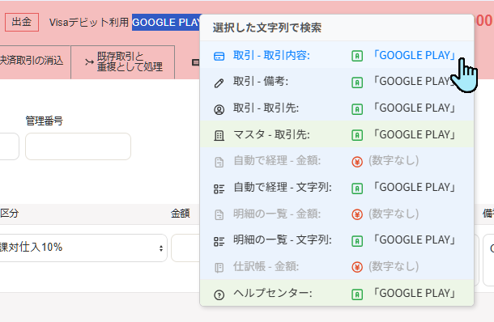
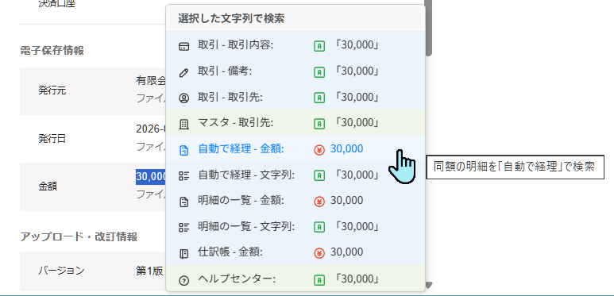
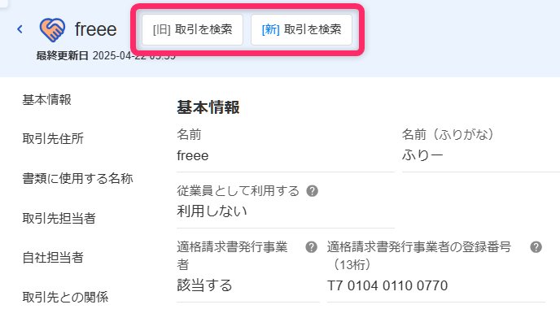

# freee会計 Ctrl+右クリック カスタム検索メニュー

freee会計の画面上で文字列や金額を選択して **Ctrl+右クリック** すると、選択した内容で取引・明細・仕訳帳などを検索できるメニューを表示するTampermonkeyユーザースクリプトです。

> **【β版です】**  
> freee会計の取引画面が従来の画面から新画面へ切り替わっている最中のため、一時的にうまく動かなくなる場面があるかもしれません。ご了承ください。

## 背景

freee会計で記帳作業をしている最中に  
「この領収書に対応する銀行やカードの明細は存在するのか」  
「✕✕✕への支払いは以前どの勘定科目で処理されていたか」  
「この取引先の取引を全部見返したい」  
と思って確認しようとするとき、対象の画面を開いて検索条件を入力して絞り込むのは、少し面倒です。  
画面上の文字列や金額を選んでそのまま検索できれば、手間なくパッと確認できて、記帳作業が捗ります。

## スクリーンショット
|▼文字列で検索|
|:---|
||

|▼金額で検索|
|:---|
||

|▼取引先の詳細|
|:---|
||

## インストール

[Raw URLはこちら](https://raw.githubusercontent.com/eustacia-jp/tampermonkey-scripts/main/freee-custom-search-menu/freee-custom-search-menu.user.js)

[Tampermonkey](https://www.tampermonkey.net/) 拡張機能が導入済みのブラウザで上記リンクを開くと、インストール確認画面が表示されます。  
一度インストールすると、以降は自動的に最新版にアップデートされます。

## できること

freee会計の画面で文字列や金額を選択し、Ctrlキーを押しながら右クリックすると、次のメニューが表示されます。  
選択した部分は、文字列として扱う項目 (緑の <code>A</code> アイコン) と、数字だけを取り出して金額として扱う項目 (赤橙の <code>¥</code> アイコン) に振り分けられます。

| グループ | メニュー | 開く画面 |
|---|---|---|
| 取引 | 取引 - 取引内容 | 取引一覧を、明細の取引内容 (摘要) で検索 |
| | 取引 - 備考 | 取引一覧を、備考で検索 |
| | 取引 - 取引先 | 取引一覧を、取引先で検索 |
| マスタ | マスタ - 取引先 | 取引先マスタを検索 |
| 明細 | 自動で経理 - 金額 / 文字列 | 「自動で経理」で、金額が一致 または 摘要が一致する明細を検索 |
| | 明細の一覧 - 金額 / 文字列 | 「明細の一覧」で、金額が一致 または 摘要が一致する明細を検索 |
| 仕訳帳 | 仕訳帳 - 金額 | 仕訳帳で、金額が一致する仕訳を検索 |
| ヘルプ | ヘルプセンター | freeeヘルプセンターを検索 |

### 新画面・旧画面の両方に対応

取引の検索は、利用している画面 (新画面 `/deals/standards`、旧画面 `/deals`) を自動で判定して、それぞれに合ったURLで開きます。  
「取引 - 取引先」では、新画面で必要になる取引先IDをfreeeから取得して検索します。

### 「自動で経理」と「明細の一覧」の使い分け

「自動で経理」では、取引日を空欄にして検索しても現在の会計期間より前の明細は表示されません。  
前期以前の明細を調べたいときは「明細の一覧」を使ってください。URLで開いた直後は現在の会計期間で絞り込まれているので、取引日の開始日側を空欄にして「絞り込み」をクリックすると、古い明細も表示されます。

## そのほかの機能

- 取引先マスタの取引先詳細画面に、「[旧] 取引を検索」「[新] 取引を検索」ボタンを追加します。押すと、その取引先の取引が開きます (新旧どちらか、利用している画面のボタンを押してください)

## 必要な権限について

このスクリプトは以下の権限を使用しています。

| 権限 | 用途 |
|---|---|
| `GM_openInTab` | 検索結果を新しいタブで開くため |
| `GM_addStyle` | メニューのスタイルを適用するため |
| `GM_xmlhttpRequest` | 他のfreee画面 (請求書など) から取引先IDを取得するため |

初めて実行するときに、Tampermonkeyから「外部サイト（freee内）へのアクセスを許可しますか？」という確認が表示される場合があります。その場合は「常に許可」を選んでください。

## 注意事項

- 本スクリプトはfreee会計の画面構造・URL・非公開の内部API (取引先の検索) に依存しています。freee側の仕様変更により、予告なく動作しなくなる可能性があります
- 自己責任でご利用ください
- 不具合や要望があれば、[Issues](https://github.com/eustacia-jp/tampermonkey-scripts/issues)でお知らせいただけると助かります
