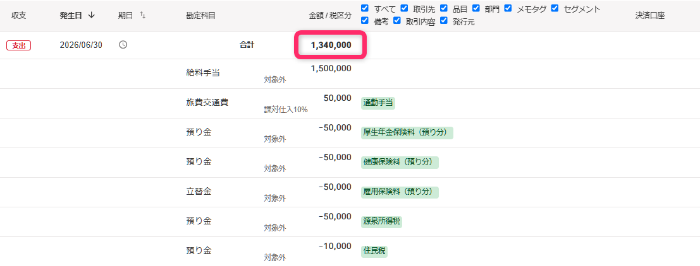
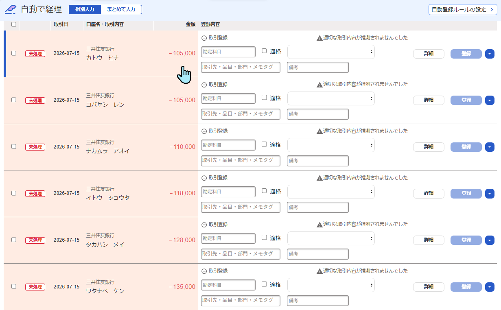
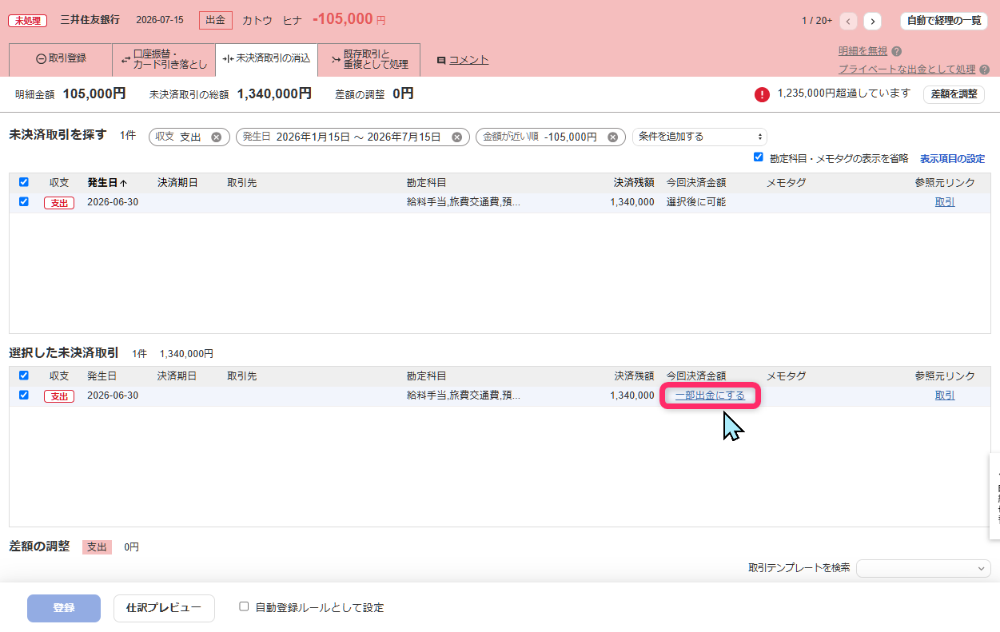
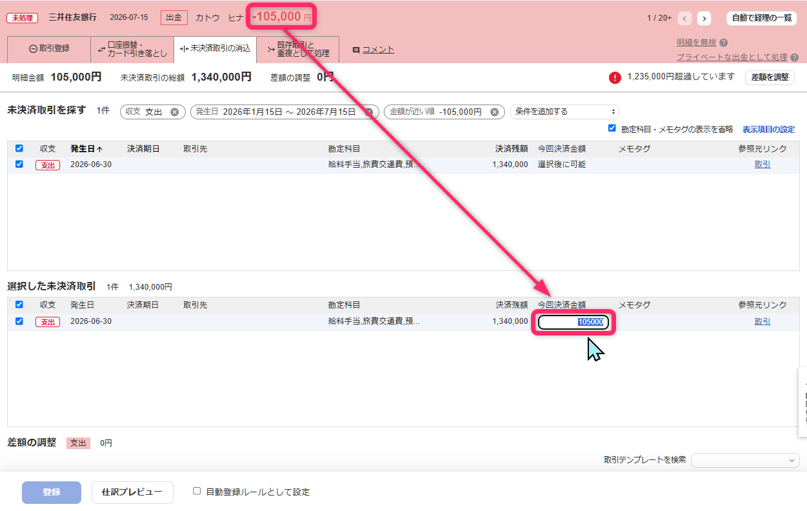

# freee 自動で経理の一部入出金補完

freee会計の「自動で経理」（`/wallet_txns`）で、1件の未決済取引を複数の明細から一部ずつ消し込んでいく作業を楽にするTampermonkeyユーザースクリプトです。

## 背景

freee人事労務で給与の計算を行い、従業員への振込は個別に行っている場合など、1件の未決済取引に対して、複数の出金明細が存在し、この両者を紐づける形で消込をしたい場面があります。  
また、1件の大きな請求があり、それに対して複数に分けて入金がある場合も、同様の消込が必要になります。

通常このようなときは、「自動で経理」の画面で個々の明細の詳細画面を開き、［未決済取引の消込］タブで対象となる未決済取引を選んでから、「一部出金にする」または「一部入金にする」をクリックします。  
すると「今回決済金額」の入力欄が表れるので、そこへいま開いている明細の金額をコピペする、または手入力することで、部分的な消込を行います。  
この操作は1回でも手間ですが、きれいに消込を行うためにはこれを明細の数だけ繰り返す必要があります。

このスクリプトはその入力を自動補完し、あわせて未決済取引一覧の行選択もクリックしやすくします。

## スクリーンショット

|▼1件の未決済取引（例：給与の合計）|
|:---|
||

|▼複数件の銀行明細（例：各従業員への振込）|
|:---|
||

|▼明細の詳細 ①未決済取引を選択して「一部出金にする」をクリック|
|:---|
||

|▼明細の詳細 ②「今回決済金額」欄に明細の金額が自動で入る|
|:---|
||

## インストール

[Raw URLはこちら](https://raw.githubusercontent.com/eustacia-jp/tampermonkey-scripts/main/freee-reconciliation-helper/freee-reconciliation-helper.user.js)

[Tampermonkey](https://www.tampermonkey.net/) 拡張機能が導入済みのブラウザで上記リンクを開くと、インストール確認画面が表示されます。  
一度インストールすると、以降は自動的に最新版にアップデートされます。

## できること

### 一部入出金の金額を自動入力

- 未決済取引を選択して「一部入金にする」「一部出金にする」をクリックすると、いま開いている明細の金額を「今回決済金額」欄に自動入力します
- freeeの仕様上、入力欄に一度フォーカスしてから外さないと登録ボタンが有効にならないため、フォーカス操作もあわせて自動化しています。ユーザーは通常どおり「どこかをクリックしてフォーカスを外す→登録」の操作だけで済みます（登録ボタンを2度クリック、という操作でもOK）
- 「選択した未決済取引」が複数ある場合は、誤った行に入力してしまうのを避けるため自動入力を行いません（freee標準の決済残額表示のままになります）

### 未決済取引の行クリックで選択

- 「未決済取引を探す」と「選択した未決済取引」テーブルの行は、どこをクリックしてもチェックボックスを選択できます
- リンク・ボタン・入力欄など本来の機能を持つ要素の上のクリックは邪魔しません（「参照元リンク」列の「取引」リンクなど）

## 注意事項

- `@match`はfreee会計の`wallet_txns`ページ（自動で経理）のみです
- freeeの画面構成（React管理下の入力欄など）に依存しています。freee側の仕様変更により、予告なく動作しなくなる可能性があります
- 自己責任でご利用ください
- 不具合や要望があれば、[Issues](https://github.com/eustacia-jp/tampermonkey-scripts/issues)でお知らせいただけると助かります

## 更新履歴

[CHANGELOG.md](./CHANGELOG.md) をご覧ください。
