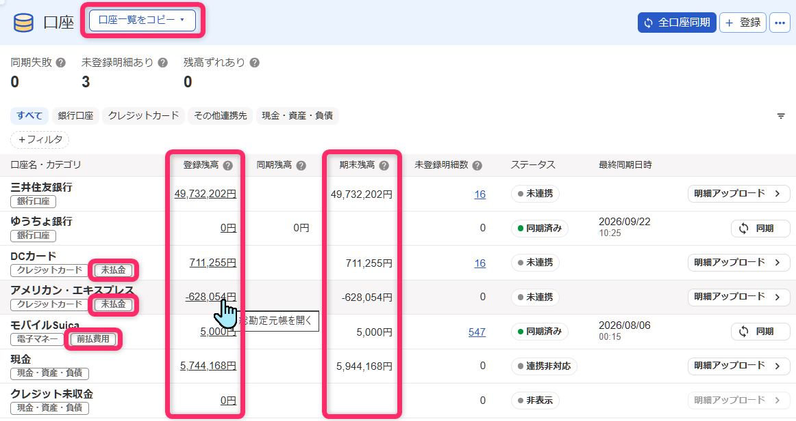
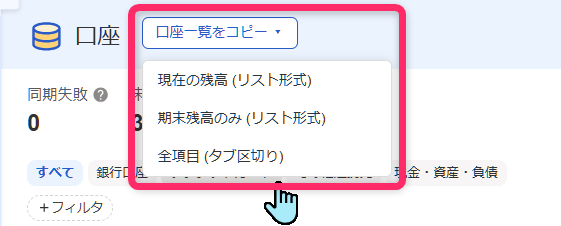
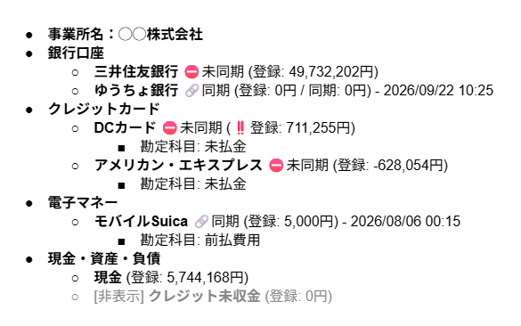

# freee 口座一覧コピー＆表示拡張

freee会計の口座一覧画面（`/walletables`）に、口座一覧をコピーする機能と、その口座に対応する勘定科目（決算書表示名）および期末残高の表示、総勘定元帳へのリンクを追加するTampermonkeyユーザースクリプトです。

複数の事業所を見る立場のアドバイザーやカスタマーサクセスの方が、対応開始時や決算時に、その事業所がもつ口座の一覧をコピーして対応記録に貼り付けるような場面を想定して作成しました。

また、たとえば「Amazonビジネス」や「モバイルSuica」のような口座が決算書上ではどの勘定科目に対応するのか、口座の一覧画面と詳細画面ですぐ確認できるようになります。  
口座に紐づく仕訳を総勘定元帳で確認したいときに、総勘定元帳を開いて検索するという操作をしなくても、口座の一覧画面と詳細画面からワンクリックで開けるようになります。

## スクリーンショット

|▼口座の一覧画面|
|:---|
||

|▼HTML形式の口座一覧|
|:---|
||

|▼口座の詳細画面（例：モバイルSuica）|
|:---|
||

<!--
  TODO(ゆう): スクリーンショットをv2.15.0時点の画面に差し替える。
  特に、コピーボタンが3つの形式（現在の残高／期末残高のみ／全項目タブ区切り）を
  選べるドロップダウンメニューになった点が伝わる画像を追加したい。
-->

## インストール

[Raw URLはこちら](https://raw.githubusercontent.com/eustacia-jp/tampermonkey-scripts/main/freee-walletables-enhancer/freee-walletables-enhancer.user.js)

[Tampermonkey](https://www.tampermonkey.net/) 拡張機能が導入済みのブラウザで上記リンクを開くと、インストール確認画面が表示されます。

## できること

### 口座一覧画面（`/walletables`）

見出し「口座」の横に「口座一覧をコピー」ボタンが表示されます。ボタンにはメニューがあり、以下の3つの形式から選んでコピーできます。

1. **現在の残高（リスト形式）** — 登録残高・同期残高・最終同期日時を含む、通常の対応記録向けの形式
2. **期末残高のみ（リスト形式）** — 決算処理向けに、現会計期間の期末残高だけを表示する形式
3. **全項目（タブ区切り）** — 表計算ソフトにそのまま貼り付けられる、全口座・全項目をフラットな表にした形式

いずれの形式も、事業所の取り違え防止のため、先頭に事業所名（`freee.data.get('company').display_name`）を含めます。

#### リスト形式（1・2）

- 画面に表示中の口座を**カテゴリー（銀行口座／クレジットカード／その他連携先／現金・資産・負債）ごとにネストした箇条書き**としてコピーします
  - Googleドキュメントなどに貼り付けると、そのまま階層付きの箇条書きリストになります（HTML形式とプレーンテキストの両方をクリップボードに書き込んでいます）
- 非表示に設定した口座は各カテゴリーの末尾にまとめ、口座名の頭に `[非表示]` と付けます
- ステータスをアイコンで簡潔に表示します（🔗同期 / ⛔未同期 / ⚠️エラー 等。連携非対応・非表示のステータスは表示しません）
- 残高に問題がありそうな場合、`‼️` の印を付けます
  - freeeが検出する「残高ずれ」（登録残高と同期残高の不一致）
  - 非表示ステータスの口座なのに、登録残高または期末残高が0円ではない
  - 資産の口座の登録残高または期末残高がマイナスになっている
  - 負債の口座の登録残高または期末残高がプラス（1円以上）になっている
- 同期エラーの口座には、トラブルシューティングページへのリンクを付けます
- 各口座について、勘定科目（決算書表示名。例：未払金、売掛金、現金及び預金）を取得して表示します（銀行口座カテゴリーと「現金」口座、非表示の口座については省略）
- 現会計期間の期末残高は総勘定元帳（内部API `/api/p/reports/general_ledgers`）から取得して表示します
  - 負債の口座は、登録残高と符号（プラス／マイナス）の意味を揃えるため、-1倍して表示します
  - 事業所の詳細設定にある「マイナスの表示方法」が「△」の場合は、`-1,000円`ではなく`△1,000円`という表示になります
- 画面の表示件数（20/50/100件）より実際の口座数が多い場合は、画面表示中の件数のみコピーした旨を知らせます

#### 全項目（タブ区切り）（3）

- 画面に表示中の全口座を1行1口座のフラットな表として出力します（表計算ソフトに直接貼り付け可能）
- 列は以下の通りです
  - 事業所名 / カテゴリ / 口座名 / 表示状態（表示・非表示） / ステータス / 登録残高 / 同期残高 / 期末残高 / 残高異常 / 未登録明細数 / 最終同期日時 / 勘定科目 / 口座詳細URL / 総勘定元帳URL
- 「残高異常」列には、上記の`‼️`と同じ条件をもとに次のいずれかを表示します
  - `残高ズレ`：freeeが検出する「残高ズレ」に該当
  - `要確認`：このスクリプト独自の符号異常判定に該当
  - `残高ズレ・要確認`：両方該当
- 勘定科目は、リスト形式では表示を省略している銀行口座・「現金」口座についても表示します
- 「口座詳細URL」は、非表示口座も含めて全口座分を取得します（`freee.data.get('walletables')`は非表示口座を含まないため、`freee.data.get('account_items')`から取得）

コピーボタンとは別に、画面上にも以下を常時表示します。

- 各口座のカテゴリーバッジ（「銀行口座」「クレジットカード」など）の隣に、同じ見た目のバッジで勘定科目（決算書表示名）を表示
- 登録残高の金額をリンク化し、クリックすると総勘定元帳をその口座名で絞り込んだ状態で開く
- 「同期残高」列の右に「期末残高」列を追加（ヒント付き）

### 口座詳細画面（`/bank_account/walletables/xxx`、`/credit_card/walletables/xxx`、`/wallet/walletables/xxx`）

- 見出し（口座名）の横に「決算書表示名：〇〇」「期末残高：〇〇円」というバッジを表示（決算書表示名バッジは銀行口座・「現金」口座・非表示の口座は対象外）
- 「関連する操作」の「現預金レポート」ボタンの隣に、同じ見た目の「総勘定元帳」ボタンを追加
  - クレジットカードには元々「現預金レポート」ボタンが無いため、「口座振替の一覧」ボタン（無い場合は「取引の一覧」ボタン）の隣に、「現預金レポート」ボタンと「総勘定元帳」ボタンの両方を追加します

## 必要な権限について

このスクリプトは`@grant none`で動作しており、特別な権限は使用していません。

- 勘定科目情報（決算書表示名）の取得には、freee会計の内部API（`/api/p/account_items/search`）を同一ドメインへの`fetch()`で呼び出しています
- 期末残高の取得には、同じく内部API（`/api/p/reports/general_ledgers`）を呼び出しています
- いずれも追加の認証情報などは不要で、ブラウザの既存ログインセッション（Cookie）でそのまま動作します

## 注意事項

- 本スクリプトはfreeeの非公開・非公式なページ構造や内部API・埋め込みデータ（`freee.data.get(...)`）に依存している部分があります。freee側の仕様変更により、予告なく一部または全部が動作しなくなる可能性があります
- 特に「勘定科目（決算書表示名）」「期末残高」「資産・負債の判定」の取得は、freeeの正式なAPIドキュメントに載っていない内部エンドポイントや、ページに埋め込まれた内部データ構造を利用しています。将来的にアクセスできなくなる可能性があります
- 表示される内容はあくまで参考情報として利用し、実際の残高等の確認はご自身で行うようにしてください
- 不具合や要望があれば、[Issues](https://github.com/eustacia-jp/tampermonkey-scripts/issues)でお知らせいただけると助かります

## 更新履歴

[CHANGELOG.md](./CHANGELOG.md) をご覧ください。
